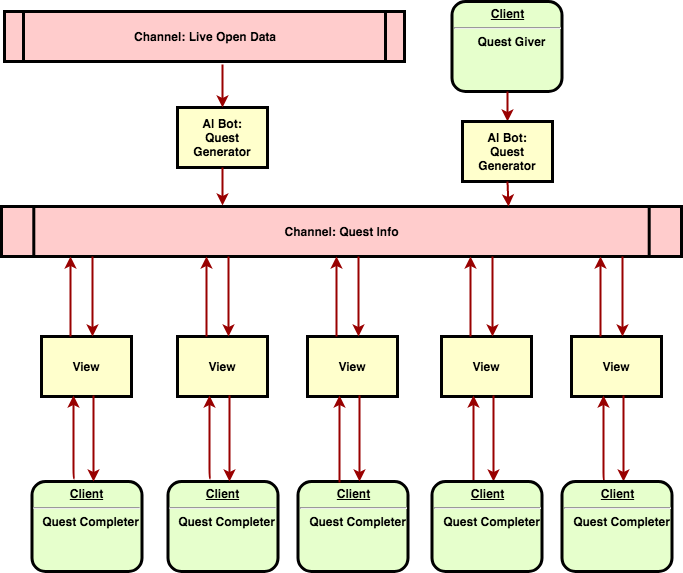

# Re-Quest
Mobile application for submitting and fulfilling requests in real time and real life.

## Features

* Quest objectives can be posted directly by users into a virtual real time marketplace, or by specialized AI that reads live data feeds and posts relevant objectives.
* View filters and AI bots automatically make sure you only see objectives relevant to you.
* Administrator dashboards allow large-scale monitoring to aid city officials, governments, and large businesses in coordination.

## Use Cases

Re-Quest can be used for:
* Real time disaster relief:
  * Governments and disaster relief organizations can post rescue objectives to coordinate volunteers, donations, and rescue workers.
* Real time trading:
  * Anyone on the street can trade goods and services. With Button integration, users can easily obtain existing marketplaces and platforms.
* Real time meet-ups:
  * Friends can form groups and meet-ups in real time for spontaneous fun.
* Real time alerts on limited time offers
  * Tourist departments can advertise must-see events with sight-seeing objectives
  * Business can advertise limited time objectives for great deals and loyalty rewards

## Advantages

Re-Quest brings the convenience, immersion, and addictive reward systems of video game RPG quests to accomplishing real world achievements.

## Architecture

